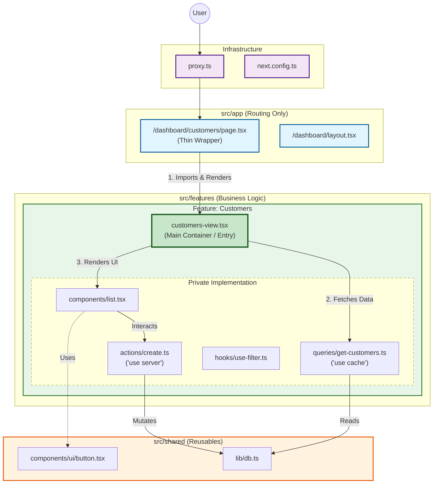

# Architecture: Feature-Sliced Container Pattern (Next.js 16)

This project follows a strict **Feature-Sliced** architecture using the **Container Pattern**. We separate routing (`src/app`) from business logic (`src/features`) to ensure maintainability and strict encapsulation.

## Architectural Diagram

The following Mermaid diagram illustrates the dependency flow: **Routing** imports **Feature Views**, which manage their own **Components** and **Data**.



## Key Rules

1.  **Routing != Logic**: `src/app` should act like a "Router Configuration". Pages simply import a view from `src/features`.
2.  **Container Pattern**: Each feature has a `*-view.tsx` (or `index.ts`) which is the public API.
3.  **Encapsulation**: Internal folders like `components`, `hooks`, `actions` inside a feature are **private**. Do not import them from other features.
4.  **Next.js 16 Caching**: Data fetching (`queries/`) uses `"use cache"` and lives close to where it's used.

## Directory Structure

```plaintext
src/
├── app/                  # Next.js App Router (Thin Layer)
│   └── (dashboard)/
│       └── customers/
│           └── page.tsx  # Imports CustomersView
├── features/             # Business Logic (The Core)
│   ├── customers/
│   │   ├── actions/
│   │   ├── components/
│   │   ├── hooks/
│   │   ├── queries/
│   │   ├── types/
│   │   └── customers-view.tsx  # <--- The Container
│   └── auth/
├── shared/               # Shared Utilities & UI
└── assets/               # Static Assets
```
