# Architecture: Non-Blocking Logic Extraction (PPR Optimized)

To fully leverage **Partial Prerendering (PPR)** and **Next.js 16**, we must strictly separate the **Static Shell** from **Async Logic**.

## 🚀 The Logic Extraction Pattern

The critical rule: **The Page Component must never block.** All logic (Auth, DB, Fetching) must be pushed down into a suspended component.

```mermaid
graph TD
    %% Define Styles
    classDef shell fill:#e3f2fd,stroke:#1565c0,stroke-width:2px,color:black;
    classDef logic fill:#fff3e0,stroke:#e65100,stroke-width:2px,color:black,stroke-dasharray: 4 4;
    classDef view fill:#e8f5e9,stroke:#2e7d32,stroke-width:2px,color:black;
    classDef blocked fill:#ffebee,stroke:#c62828,stroke-width:1px,color:#c62828,stroke-dasharray: 2 2;

    %% ENTRY
    Browser((Browser)) --> |Request| Page

    %% LAYER 1: STATIC SHELL
    subgraph L1 ["1️⃣ Layer 1: Static Shell (Instant Render)"]
        Page["Page.tsx"]:::shell
        Suspense["< Suspense fallback=Skeleton >"]:::shell

        Page --> |Returns Immediately| Suspense
    end

    %% LAYER 2: LOGIC COMPONENT
    subgraph L2 ["2️⃣ Layer 2: Async Logic (Streaming)"]
        Logic["< AgentsData > (Async)"]:::logic

        %% The "Heavy" Lifting
        subgraph TASKS ["Blocking Tasks"]
           Auth["await auth()"]:::blocked
           Params["await params"]:::blocked
           Fetch["prefetchQuery()"]:::blocked
        end

        Logic --> Auth
        Auth --> Params
        Params --> Fetch
    end

    %% LAYER 3: VIEW
    subgraph L3 ["3️⃣ Layer 3: View Container"]
        View["< AgentsView >"]:::view
    end

    %% Flow
    Suspense --> |Streams| Logic
    Fetch --> |Hydrates| View

    %% Annotations
    style L1 fill:white,stroke:#333
    style L2 fill:white,stroke:#333
    style L3 fill:white,stroke:#333
```

## ⚠️ Why This Matters (PPR)

If you put `await auth()` inside `Page.tsx`:

1.  The **entire page** waits for the database.
2.  The user sees a white screen (Time to First Byte delay).
3.  The static shell (navbars, sidebars) cannot render.

By moving it to `<AgentsData>`:

1.  `Page.tsx` renders **instantaneously**.
2.  User sees the App Shell + Loading Skeletons.
3.  `<AgentsData>` processes auth/data in the background.
4.  Content streams in when ready.

## 🛠️ Implementation Checklist

| Feature             | Placement              | Reason                           |
| :------------------ | :--------------------- | :------------------------------- |
| **Navbar / Layout** | `layout.tsx`           | Static, instant render.          |
| **Search Params**   | `Layer 2 (AgentsData)` | Needs `await`, would block Page. |
| **Auth Check**      | `Layer 2 (AgentsData)` | Needs DB call, would block Page. |
| **Data Fetching**   | `Layer 2 (AgentsData)` | Slowest part, must be suspended. |
| **UI Rendering**    | `Layer 3 (AgentsView)` | Pure presentation.               |
