# 🚀 Next.js 16 Enterprise Architecture

> **Module Pattern · Server/UI Split · Partial Prerendering (PPR) Optimized**

This repository defines a battle-tested architecture for Next.js 16 applications. It enforces strictly modular features, non-blocking rendering paths, and clean separation between **Routing** and **Business Logic**.

---

## 📂 Project Scaffolding

Copy this structure to start your project. The core principle is **"Routing (`app`) is for Config, Modules (`modules`) are for Code."**

```plaintext
src/
├── app/                      # 🌍 ROUTING LAYER (Static Zone)
│   └── (dashboard)/
│       └── customers/
│           └── page.tsx      # ✅ The "Static Shell" (Imports Async Logic)
│
├── modules/                  # 📦 BUSINESS LOGIC (Feature Modules)
│   ├── customers/            # Your Feature Name
│   │
│   │   ├── server/           # 🔒 BACKEND (Server Logic)
│   │   │   ├── actions.ts    # Mutations ("use server")
│   │   │   └── queries.ts    # Fetching ("use cache")
│   │
│   │   ├── ui/               # 🎨 FRONTEND (Presentation)
│   │   │   ├── views/        # Page Containers (The "View")
│   │   │   │   └── customers-view.tsx
│   │   │   └── components/   # Private Components
│   │   │       ├── list.tsx
│   │   │       └── header.tsx
│   │
│   │   ├── params.ts         # 📎 URL State (Nuqs Parsers)
│   │   ├── schemas.ts        # 🛡️ Validation (Zod Contracts)
│   │   └── types.ts          # 📐 TypeScript Definitions
│
├── shared/                   # 🌐 SHARED LAYER (Global Utils/UI)
├── trpc/                     # 🔌 API LAYER (tRPC or similar)
└── ...
```

---

## ⚡ How It Works: The "Non-Blocking" Flow

To support **PPR (Partial Prerendering)**, we never block the main page with data fetching.

### The 3-Layer Architecture

1.  **Layer 1 (The Static Shell)**: `app/page.tsx` renders _instantly_. It shows the page skeleton while data loads.
2.  **Layer 2 (The Async Logic)**: A dedicated component (e.g., `CustomersData`) handles authentication, permissions, and data fetching in the background.
3.  **Layer 3 (The View)**: `modules/.../view.tsx` renders the UI once data is ready.

### Visual Flow (Mermaid)

```mermaid
graph TD
    %% Styling
    classDef shell fill:#e3f2fd,stroke:#1565c0,stroke-width:2px,color:black;
    classDef logic fill:#fff3e0,stroke:#e65100,stroke-width:2px,color:black,stroke-dasharray: 4 4;
    classDef view fill:#e8f5e9,stroke:#2e7d32,stroke-width:2px,color:black;

    %% ENTRY
    User((User)) --> |URL Request| Page

    %% LAYER 1
    subgraph L1 ["1️⃣ Layer 1: Static Shell (app/page.tsx)"]
        Page["Page Component"]:::shell
        Suspense["< Suspense fallback='Loading...' >"]:::shell
        Page --> |Instant Render| Suspense
    end

    %% LAYER 2
    subgraph L2 ["2️⃣ Layer 2: Async Logic (modules/.../ui)"]
        Logic["< CustomersData > (Async)"]:::logic

        subgraph TASKS ["Blocking Tasks"]
           Auth["await auth()"]
           Params["await loadSearchParams()"]
           Fetch["prefetchQuery()"]
        end

        Logic --> Auth --> Params --> Fetch
    end

    %% LAYER 3
    subgraph L3 ["3️⃣ Layer 3: View Container (modules/.../views)"]
        View["< CustomersView >"]:::view
    end

    %% Flow
    Suspense --> |Streams| Logic
    Fetch --> |Hydrates| View
```



---

## 🛠️ Step-by-Step Implementation Guide

Follow this guide when creating a new feature (e.g., "Invoices").

### Step 1: Create the Module

Create `src/modules/invoices` with folders `server` and `ui`.

### Step 2: Define the Logic (`server/`)

Write your Zod schemas in `schemas.ts`, then create fetching logic in `server/queries.ts` using Next.js 16 Caching.

```typescript
// src/modules/invoices/server/queries.ts
import "use cache"; // Cache Component
import { cacheLife } from "next/cache";

export async function getInvoices() {
  cacheLife("minutes");
  return db.invoices.findMany();
}
```

### Step 3: build the UI (`ui/views/`)

Create the View Container. This is what the user sees.

```typescript
// src/modules/invoices/ui/views/invoices-view.tsx
export function InvoicesView({ data }) {
  return (
    <div>
      {data.map((inv) => (
        <InvoiceCard key={inv.id} {...inv} />
      ))}
    </div>
  );
}
```

### Step 4: The Async Handoff (`ui/invoices-data.tsx`)

Create the intermediate component that connects logic to UI.

```typescript
// src/modules/invoices/ui/invoices-data.tsx
export const InvoicesData = async ({ searchParams }) => {
  await auth.check(); // Blocking Auth
  const data = await getInvoices(); // Blocking Fetch
  return <InvoicesView data={data} />;
};
```

### Step 5: The Static Route (`app/invoices/page.tsx`)

Finally, hook it up to the router. **Do not await anything here!**

```typescript
import { Suspense } from "react";
import { InvoicesData } from "@/modules/invoices/ui/invoices-data";

export default function Page({ searchParams }) {
  return (
    <Suspense fallback={<Skeleton />}>
      <InvoicesData searchParams={searchParams} />
    </Suspense>
  );
}
```

---

## ✅ Rules of the Road

| Rule                 | Description                                                                  |
| :------------------- | :--------------------------------------------------------------------------- |
| **No Await in Root** | Never block `page.tsx` with `await`. Use a suspended component.              |
| **Module Scope**     | `modules/A` cannot import `modules/B` internals. Use the public `view` only. |
| **Strict Split**     | Logic stays in `modules/server`. React stays in `modules/ui`.                |
| **Nuqs Params**      | Use `nuqs` for type-safe URL state management.                               |
| **Resilience**       | Always wrap async parts with `<ErrorBoundary>`.                              |
